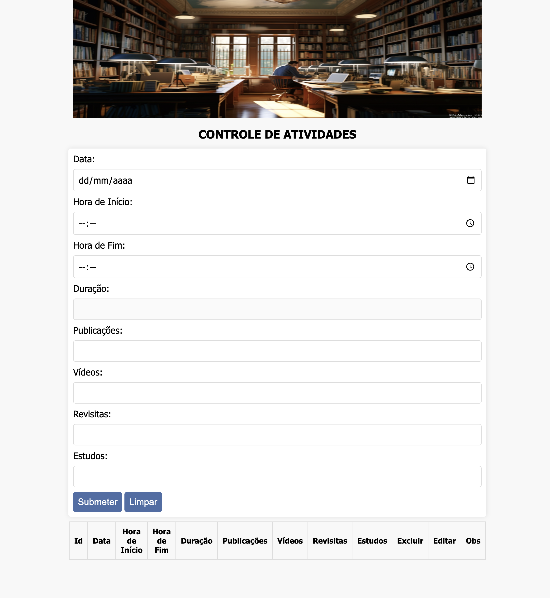

#
&nbsp;
&nbsp;


# Sobre o MVP
A aplicação consiste no projeto de conclusão da Sprint 1 do **Curso de Desenvolvimento Full Stack**  na PUC-Rio, e trata-se de um controle de atividades de serviço de campo. O Publicador de Boas Novas, pode registrar suas atividades diárias de trabalho.

# Tecnologias
+ Python
+ Flask
+ OpenAPI
+ SQLite
+ SQLAlchemy
+ HTML5
+ CSS3
+ JavaScrip

# Como executar?

A aplicação está dividida em 2 repositórios, sendo:

- Back-end (Este repositório)

- > [Front-end] https://github.com/mjosejunior/mvp_jrmj_sp1_front

- > [Vídeo de Visão Geral do Projeto] https://youtu.be/elgTpzwykfo

```powershell

#Será necessário ter todas as libs python listadas no ```requirements.txt``` instaladas.
#Após clonar o repositório, é necessário ir ao diretório raiz, pelo terminal, para poder executar os #comandos descritos abaixo.
```
> É fortemente indicado o uso de ambientes virtuais do tipo [virtualenv](https://virtualenv.pypa.io/en/latest/installation.html).
```

(env)$ pip install -r requirements.txt

#Este comando instala as dependências/bibliotecas, descritas no arquivo `requirements.txt`.

#Para executar a API  basta executar:


(env)$ flask run --host 0.0.0.0 --port 5001


#Em modo de desenvolvimento é recomendado executar utilizando o parâmetro reload, que reiniciará o servidor
#automaticamente após uma mudança no código fonte. 


(env)$ flask run --host 0.0.0.0 --port 5001 --reload

```
Abra o [http://localhost:5001/#/](http://localhost:5001/#/) no navegador para verificar o status da API em execução.
```
```
Em caso de dificuldades, por favor, entre em contato.